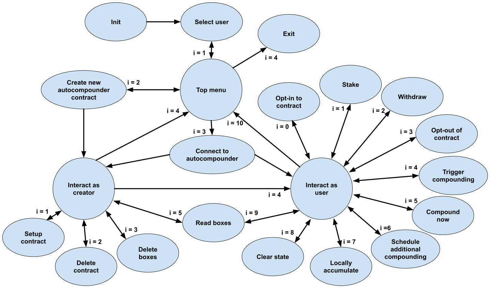

# Staking Pools Autocompounder with Beaker and Box Storage

This project includes an alternative implementation of a smart contract of an autocompounder for distribution pools 
from the [Staking Pools Autocompounder](https://github.com/uhudo/staking-pools-autocompounder) project.
The smart contract supports autocompounding of distribution pools of [Cometa](https://cometa.farm/) platform.
Since both projects implement the same functionality, refer to 
[README.md](https://github.com/uhudo/staking-pools-autocompounder/blob/main/README.md)
of [Staking Pools Autocompounder](https://github.com/uhudo/staking-pools-autocompounder) project for a detailed 
description.

The implementation takes advantage of Algorand's new functionality introduced with AVM8 - the 
[box storage](https://developer.algorand.org/articles/smart-contract-storage-boxes/).
Box storage is elegantly used to keep track of how much interest has each user earned between two autocompounding 
instances.
Since the autocompounding can be done arbitrarily frequently, there is a need for an arbitrary amount of storage, which 
cannot be achieved using global or local storage (especially since autocompounding can be triggered by 
any user but the recorded data needs to be accessible by all other users as well).
However, this can easily be achieved with box storage. 

The difference in the implementation of this project and the
[Staking Pools Autocompounder](https://github.com/uhudo/staking-pools-autocompounder) project, 
is that this project uses the 
[Beaker](https://algorand-devrel.github.io/beaker/html/index.html) framework instead of pure 
[PyTEAL](https://github.com/algorand/pyteal).
Comparing the smart contracts of [the former](contract.py) and 
[the latter](https://github.com/uhudo/staking-pools-autocompounder/blob/main/src/CompoundContract.py) shows that 
Beaker framework facilitates the development by simplifying contract's state management and code organization as well as
providing methods for easier interactions.
Nevertheless, comparing the smart contracts directly on the compiled TEAL code level 
(e.g. examples of [the former](https://testnet.algoexplorer.io/application/157620928) vs. 
[the latter](https://testnet.algoexplorer.io/application/157618091)) shows certain differences (ca. 20%).
However, studying the TEAL code, it is possible to see that these come simply from different memory organizations.
This was confirmed by verifying that both provide the same functionality.

# Demo Interactions

The project includes a [script](interactions_state_machine.py) for a sample interaction with autocompounding smart 
contracts through a simple command-line interface.
The script implements the state machine shown in figure below.

An example scenario of interactions with the platform through the provided interaction 
[script](interactions_state_machine.py) has been recorded and the
[video excerpts](demo/README.md) documented.

To test the platform with the provided [script](interactions_state_machine.py), the following is required:
- Python (>=3.10) with libraries in [requirements.txt](requirements.txt), 
which can be installed using `pip install -r requirements.txt`
- One or more mnemonics stored in plain text in .txt files (with spaces as delimiters)
*<= This is for simplicity of testing only!*
- Connection to Algorand Testnet (e.g. via [Sandbox](https://github.com/algorand/sandbox) or 
publicly available nodes by [AlgoExplorer](https://algoexplorer.io/) 
https://node.testnet.algoexplorerapi.io)
- Test ALGO and e.g. test USDC, which can both be received at https://dispenser.testnet.aws.algodev.network/

For testing, clone the repository and run the provided [script](interactions_state_machine.py).

# Notice

The project was developed during [Algorand Greenhouse Hack #3](https://gitcoin.co/hackathon/greenhouse3/onboard) 
and submitted to [Learning Challenge: Box Storage with Beaker](https://gitcoin.co/issue/29662) category.

The smart contracts were written using the [Beaker](https://algorand-devrel.github.io/beaker/html/index.html) framework,
which uses [PyTEAL](https://github.com/algorand/pyteal).
The contracts are [ABI compliant](https://developer.algorand.org/docs/get-details/dapps/smart-contracts/ABI/).
The command-line interface is written in Python and uses the 
[py-algorand-sdk](https://github.com/algorand/py-algorand-sdk).

The software is not meant for production deployment - the smart contracts have not been audited and the provided 
test user interface does not follow the recommended security guidelines regarding handling of mnemonics.

Author: Uroš Hudomalj - https://github.com/uhudo
